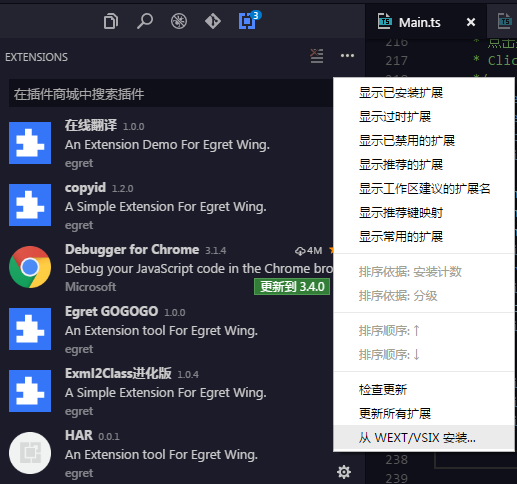
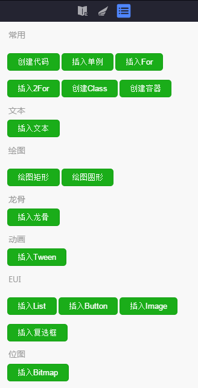
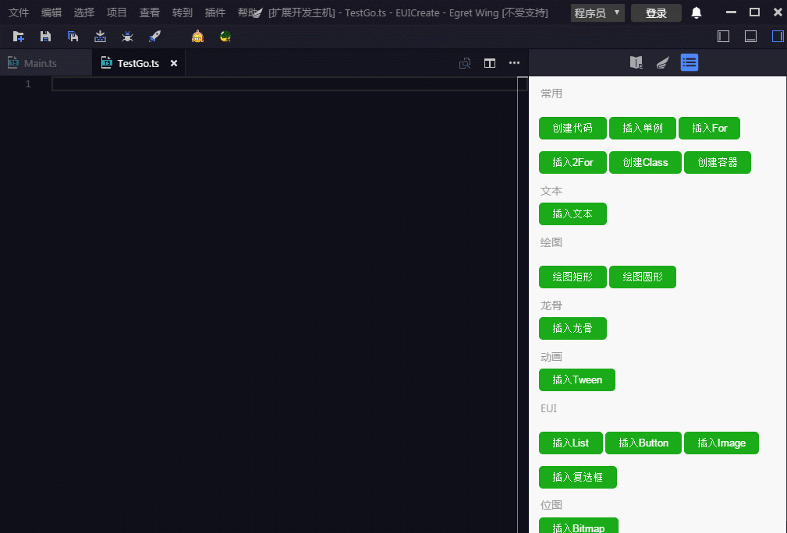
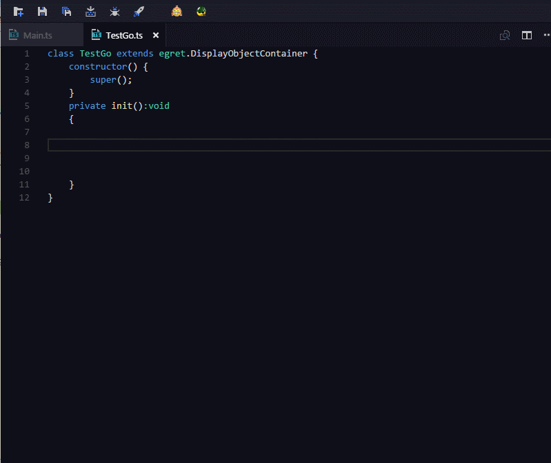

# EgretGOGOGO 插件使用

## 概述
 EgretGOGOGO是一款代码模版工具，旨在Egret开发中提升代码搬运效率，让生产过程改善一些常规的操作

## 安装使用 
  下载对应的插件文件，选择插件栏(Ctrl + Shift + X)，在Egret wing里面进行安装。点击菜单【从WEXT/VSIX 安装...】选择安装文件
  
   
  
  
## 界面说明
 
 该插件通过右则栏打开，界面上拥有多个代码搬迁的快捷功能，通过点击可以快速生成相应的代码
 
   
 

## 使用说明
 
 <b>1.选择生成</b>
 
  鼠标点击编辑区域，选择功能按键需要搬运的代码
   

 <b>2.使用提示代码提示生成</b>
  
   使用代码提示如，draw_rect,draw_circle,Button ,TextField ,Bitmap 能够生成对应的代码片段
     
   
   
  

## 平台说明
支持 window
